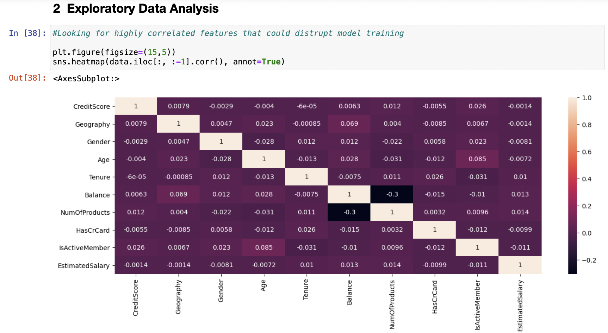

# supervised-ml-customer-churn
Develop a model to forecast customer turnover at the bank.

--Dataset Summary--
1. Client demographics 
   a. Age 
   b. Gender 
   c. Geography 
2. Account information 
   a. Balance 
   b. Products 
   c. Credit Card 
   d. Active (Y/N) 

--Technique and Process--
1. Downloaded and reviewed data
2. Preprocessed data
3. Exploratory data analysis

4. Train different models 
   a. Unscaled and scaled data 
   b. Upsampled data 
   c. Tuning hyperparameters 
5. Model validation 
   a. F1 
   b. AUC-ROC 

--Results--
Developed a Random Forest model w/ unscaled, upsampled data and several iterations of hyperparamter tuning that resulted in scores:
1. Validation data 
    F1: 61.19 
    AUC-ROC: 84.70 
2. Test data 
    F1: 62.15 
    AUC-ROC:86.54 
